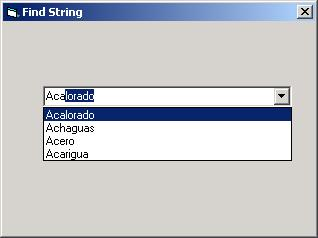

<div align="center">

## Find faster a String in Combo or ListBox while typing \(Using SendMessage API\)


</div>

### Description

This code is useful to look at a string inside a ComboBox or ListBox, while you typing it
 
### More Info
 
The String to find.

You must set the API Declaration in a Module

If the string is found, it is set position respective.


<span>             |<span>
---                |---
**Submitted On**   |
**By**             |[Omar Vivas](https://github.com/Planet-Source-Code/PSCIndex/blob/master/ByAuthor/omar-vivas.md)
**Level**          |Beginner
**User Rating**    |4.7 (42 globes from 9 users)
**Compatibility**  |VB 3\.0, VB 4\.0 \(16\-bit\), VB 4\.0 \(32\-bit\), VB 5\.0, VB 6\.0
**Category**       |[Windows API Call/ Explanation](https://github.com/Planet-Source-Code/PSCIndex/blob/master/ByCategory/windows-api-call-explanation__1-39.md)
**World**          |[Visual Basic](https://github.com/Planet-Source-Code/PSCIndex/blob/master/ByWorld/visual-basic.md)
**Archive File**   |[](https://github.com/Planet-Source-Code/omar-vivas-find-faster-a-string-in-combo-or-listbox-while-typing-using-sendmessage-api__1-30626/archive/master.zip)

### API Declarations

```
#If Win32 Then
 Declare Function SendMessage Lib "User32" Alias "SendMessageA" _
 (ByVal hWnd As Long, ByVal wMsg As Long, _
  ByVal wParam As Long, lParam As Any) As Long
#Else
 Declare Function SendMessage Lib "User" _
 (ByVal hWnd As Integer, ByVal wMsg As Integer, _
  ByVal wParam As Integer, lParam As Any) As Long
#End If
Const CB_FINDSTRINGEXACT = &H158 'Search string Exact in ComboBox
Const LB_FINDSTRINGEXACT = &H1A2 'Search string Exact in ListBox
Const CB_FINDSTRING = &H14C		'Search string to begin in ComboBox
Const LB_FINDSTRING = &H18F		'Search string to begin in ListBox
```


### Source Code

```
Private Sub Combo1_KeyPress(KeyAscii As Integer)
 Dim CB As Long
 Dim FindString As String
 Const CB_ERR = (-1)
 Const CB_FINDSTRING = &H14C
 If KeyAscii < 32 Or KeyAscii > 127 Then Exit Sub
 If Combo1.SelLength = 0 Then
 FindString = Combo1.Text & Chr$(KeyAscii)
 Else
 FindString = Left$(Combo1.Text, Combo1.SelStart) & Chr$(KeyAscii)
 End If
 CB = SendMessage(Combo1.hWnd, CB_FINDSTRING, -1, ByVal FindString)
 If CB <> CB_ERR Then
 Combo1.ListIndex = CB
 Combo1.SelStart = Len(FindString)
 Combo1.SelLength = Len(Combo1.Text) - Combo1.SelStart
 End If
 KeyAscii = 0
End Sub
```

